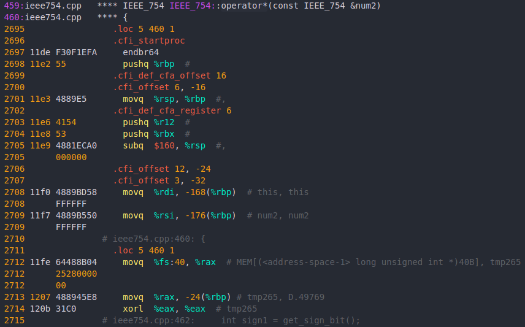
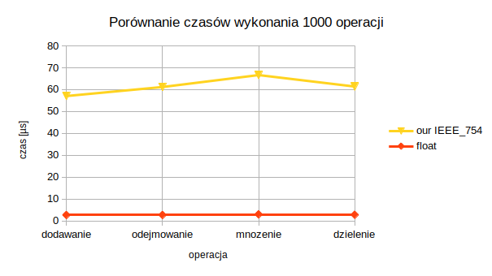

# Implementacja procedur obliczeń na liczbach zmiennoprzecinkowych <br> za pomocą instrukcji stałoprzecinkowych


## Organizacja i Architektura Komputerów
### INEK00027P
### Projekt 

<br>

| Wydział Elektroniki                   | Kierunek: Informatyka techniczna |
| ------------------------------------- | -------------------------------- |
| Grupa zajęciowa: środa 15:15-16:55 TP | Semestr 2020/21 LATO             |
| 8 Łach Piotr                          | Nr indeksu: 256761               |
| 13 Jakub Szpak                        | Nr indeksu: 252782               |
| Prowadzący:                           | Dr hab. inż. Tadeusz Tomczak     |

<br>

## Co zostało wykonane

Podczas tego semestru udało się nam zaimplementować reprezentację liczby zmiennoprzecinkowej według standardu IEEE 754-2008 32bit wraz z czterema podstawowymi operacjami arytmetycznymi, w których skład wchodzą: dodawanie, odejmowanie, mnożenie i dzielenie. Całość została wykonana w postaci biblioteki w języku C++, do której dołączyliśmy testy jednostkowe wykonane przy pomocy biblioteki zewnętrznej GoogleTest. Do przechowywania bitów reprezentacji wykorzystaliśmy std::bitest, a zmienne oznaczające długość poszczególnych pól w bitsecie przechowujemy w klasie jako statyczne wyrażenie stałe takie jak liczba bitów mnożnika, dzięki czemu zmiana na reprezentację np. 64 bit powinna ograniczyć się do kilku poprawek oraz nowych testów. Projekt następnie przetestowaliśmy pod kątem czasu wykonania poszczególnych operacji oraz pod kątem obecności operacji zmiennoprzecinkowych w assemblerze wygenerowanym z naszego kodu, poprzez uruchomienie gcc z odpowiednimi flagami. Pod koniec semestru rozpoczęliśmy prace nad dodaniem dwóch trybów zaokrąglania (symetryczne do większej
wartości bezwględnej, symetryczne do parzystej).

Dzięki wskazówce prowadzącego napisaliśmy masowe testy jednostkowe, które okazały się dla nas najbardziej wartościowe. W zautomatyzowany sposób porównują one bit po bicie naszą implementację z reprezentacją float. 

Fragment wnętrza pętli dla mnożenia wykonywany dla każdej pary liczb:

```c++
            float f_result = numbers[i].to_float() * numbers[j].to_float();
            IEEE_754 result = numbers[i] * numbers[j];
            EXPECT_EQ(f_result, result.to_float());
```


<br>

## Uruchomienie projektu

Aby uruchomić projekt, potrzebne są dwa narzędzia:
- g++ wersja: 9.3.0
- cmake wersja: 3.16.3

Uruchomienie testów z linii komend:
```bash
cd ieee754_implementation
git clone https://github.com/google/googletest.git
mkdir build && cd build
cmake ..
make
./mytests
```

<br>

## Operacje

Każda operacja została napisana za pomocą przeciążenia odpowieniego operatora w klasie IEEE_754.
Wszystkie z nich rozpoczynają się od sprawdzenia potencjalnych wyjątków:

- przykład sprawdzenia wyjątków z operatora+

```c++
    // jeśli któraś z reprezentacji to NaN, zwróć ją
    if (exponent1_ulong == max_exponent && mantissa1.to_ulong() != 0)
    {
        return *(this);
    }

    if (exponent2_ulong == max_exponent && mantissa2.to_ulong() != 0)
    {
        return num2;
    }

    // jeśli któraś z reprezentacji to Nieskończoność, zwróc ją
    if (exponent1_ulong == max_exponent && mantissa1.to_ulong() == 0)
    {
        if (exponent2_ulong == max_exponent && mantissa2.to_ulong() == 0 && sign1 != sign2)
        {
            // chyba że obie to nieskończoności o przeciwnym znaku, wtedy zwróć NaN
            return IEEE_754(std::bitset<IEEE_754::number_of_bits>(0b01111111110000000000000000000000));
        }
        return *(this);
    }

    if (exponent2_ulong == max_exponent && mantissa2.to_ulong() == 0)
    {
        return num2;
    }
```
<br>

- następnym etapem w każdym operatorze jest przepisanie bitów mnożnika do bitsetu powiększonego o 0 lub 1 z przodu oraz ustawienie wykładnika na 1 zależnie od tego czy liczba jest zdenormalizowana czy nie

<br>

```c++
    if (num1_is_denormalized)
    {
        _mantissa1[IEEE_754::number_of_mantissa_bits] = 0;
    }
    else
    {
        _mantissa1[IEEE_754::number_of_mantissa_bits] = 1;
    }

    if (num2_is_denormalized)
    {
        _mantissa2[IEEE_754::number_of_mantissa_bits] = 0;
    }
    else
    {
        _mantissa2[IEEE_754::number_of_mantissa_bits] = 1;
    }
```
- dalsze operacje zależą już od operatora, dla przykładu w dodawaniu i odejmowaniu skalujemy w tym miejscu jeden z mnożników tak, aby wykładniki obu reprezentacji były sobie równe, w mnożeniu i dzieleniu natomiast od razu przystępujemy do odpowiednio mnożenia czy dzielenia mnożników i dodawania/odejmowania wykładników
- warto zaznaczyć, że w przypadku mnożenia i dzielenia musimy dokonać wstępnego skalowania po mnożeniu/ dzieleniu mnożników.
<br>

mnożenie: 
```c++
mantissa_multiply_result /= pow_of_two(IEEE_754::number_of_mantissa_bits);
```
dzielenie:
```c++
unsigned long long mantissa_division_result = _mantissa1.to_ulong() * IEEE_754::pow_of_two(IEEE_754::number_of_mantissa_bits) / _mantissa2.to_ulong();
```

- po wykonanych operacjach na mnożniku i wykładniku przystępujemy do operacji, które mają na celu sprawdzenie, czy mnożnik i wykładnik mieszczą się w swoim zakresie:

```c++
    // jeśli wynik odejmowania wykładników mniejszy od 0 to skalowanie mantysy
    while (exponent_result <= 0 && mantissa_result.to_ulong() != 0)
    {
        exponent_result++;
        mantissa_result >>= 1;
    }

    // jeśli wynik dodawania mnożników między 2 a 4 to skalowanie mantysy
    if (mantissa_result[number_of_mantissa_bits + 1] == 1)
    {
        exponent_result += 1;
        scale_mantissa_down(1, mantissa_result);
    }

    // skalowanie mnożnika do momentu, aż na miejscu liczby całkowitej nie znajdzie się 1 lub aż wykładnik wyniesie 0
    while (mantissa_result[IEEE_754::number_of_mantissa_bits] == 0 && exponent_result > 0)
    {
        // TODO: Jeśli pętla wykonuje się więcej niż 24 razy można dodać przerwanie i ustawić exponent_result na 0
        exponent_result -= 1;
        if (exponent_result != 0)
            mantissa_result <<= 1;
    }

    // wartość większa niż max
    if (exponent_result >= max_exponent)
    {
        exponent_result = max_exponent;
        mantissa_result = 0;
    }
```

- ostatnim etapem każdej operacji jest złączenie poszczególnych bitów w jeden bitset o wyznaczonym rozmiarze (przykład z operatora*):

```c++
    result.get_number()[IEEE_754::number_of_bits - 1] = (sign1 != sign2);

    IEEE_754::paste_bits_into(mantissa_result, result.number, 0, IEEE_754::number_of_mantissa_bits - 1, 0, IEEE_754::number_of_mantissa_bits - 1);

    IEEE_754::paste_bits_into(std::bitset<IEEE_754::number_of_exponent_bits>(exponent_result), result.number, IEEE_754::number_of_mantissa_bits, IEEE_754::number_of_mantissa_bits + IEEE_754::number_of_exponent_bits - 1);

```

## Sprawdzenie kodu assemblera

Kod został sprawdzony pod względem wystąpienia zmiennoprzecinkowych rozkazów w kodzie assemblera. 

```bash
$ gcc ieee754.cpp -o ieee -Wa,-adhln=ieee.s -g -fverbose-asm -O3 -march=native
```

Fragment wygenerowanego kodu po użyciu powyższej komendy. 

<br>




## Porównanie czasów

Wykonano pomiary czasów poszczególnych operacji float'a oraz naszej implementacji IEEE_754. W tym celu wykorzystaliśmy bibliotekę std::chrono.

```cpp

    std::vector<IEEE_754> numbers;
    
    ...

    auto start = std::chrono::system_clock::now();

    for (int x = 0; x < 100; x++)
    {
        for (int i = numbers.size() - 1; i >= 0; i--)
        {

            for (size_t j = 0; j < numbers.size(); j++)
            {
                IEEE_754 result = numbers[i] / numbers[j];
            }
        }
    }

    auto end = std::chrono::system_clock::now();
    auto elapsed = std::chrono::duration_cast<std::chrono::microseconds>(end - start);
```

Powyższy fragment kodu to 40000 wykonanych operacji. Na takiej zasadzie wykonano wszystkie pomiary czasowe. 

Poniższe dane to czasy wykonywania 1000 operacji.

|              | czas wykonania 1000 operacji [µs] |             |          |           |
| ------------ | --------------------------------- | ----------- | -------- | --------- |
|              | dodawanie                         | odejmowanie | mnozenie | dzielenie |
| our IEEE_754 | 57.1                              | 61.225      | 66.675   | 61.425    |
| float        | 2.725                             | 2.75        | 3.025    | 2.825     |

<br>





Nasza implementacja okazała się średnio 20 razy wolniejsza od podstawowej reprezentacji liczby zmiennoprzecinkowej float w C++.

## Podsumowanie


Niestety nie znaleźliśmy sposobu wymuszenia zaokrąglania przez obcięcie przy operacjach na float'ach. W związku z tym wybrane testy nie zostały zaakceptowane.Liczba wynikowa, wydająca się na pierwszy rzut oka taka sama dla float'a i naszej implementacji może się różnić się na poziomie najmłodszych bitów.

Przykład wymuszenia zaokrąglenia "round to nearest":

```c++
  #include <cfenv>
  ...
  fesetround(FE_TONEAREST);
```

Wybrany test zakończony niepowodzeniem.

```bash
division test 1.3
0.285714 = 2.93874e-39 / 1.02856e-38
00111110100100100100100100100100 = 00000000001000000000000000000000 / 00000000011100000000000000000000

Expected equality of these values:
  f_result
    Which is: 0.285714
  result.to_float()
    Which is: 0.285714
```


Projekt uważamy za zakończony sukcesem, mimo dużej różnicy w czasie wykonywania między implementacją naszą, a implementacją programistów języka C++. Wydaję nam się, że cel był zdecydowanie inny, więc jesteśmy jak najbardziej zadowoleni z wyników! 
