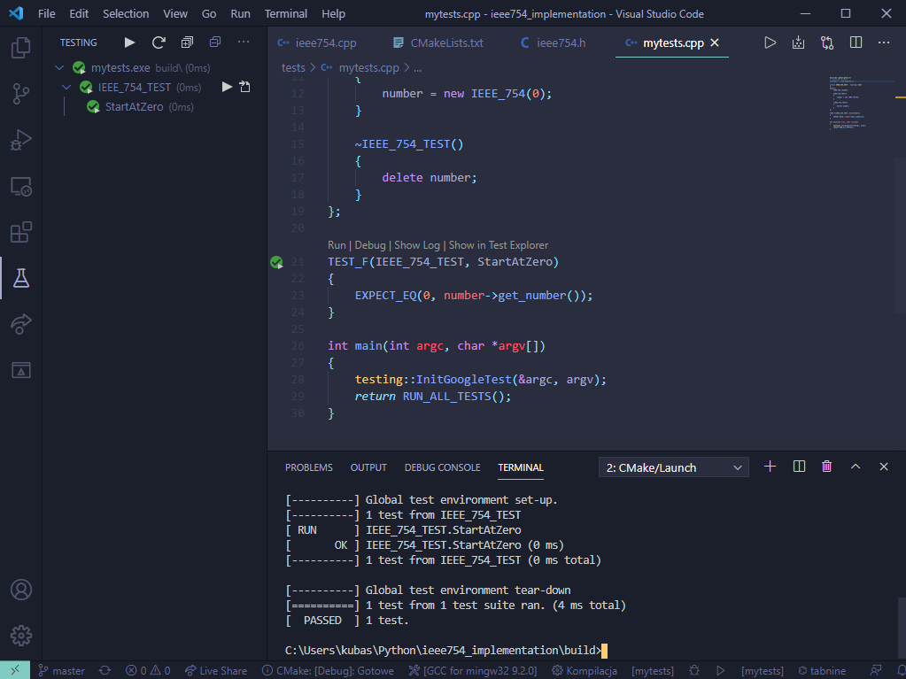

---

false

marp: true

color: #000

colorSecondary: #333

backgroundColor: #fff

--allow-local-files

---

# Implementacja procedur obliczeń na liczbach zmiennoprzecinkowych za pomocą instrukcji stałoprzecinkowych

Jakub Szpak

Piotr Łach

---

# IEEE754 32bit

1 bit na znak
8 bitów na wykładnik
23 bity na mnożnik


---


# bitset > tablica boolean'ów

The class template bitset represents a fixed-size sequence of N bits. Bitsets can be manipulated by standard logic operators and converted to and from strings and integers. 


---
# wybór biblioteki testów jednostkowych

Google Test is a unit testing library for the C++ programming language, based on the xUnit architecture.


# gtest + cmake

In software development, CMake is cross-platform free and open-source software for build automation, testing, packaging and installation of software by using a compiler-independent method.




<!--  -->

---

# skalowalność
 
```c++

    static constexpr uint8_t number_of_bits = 32;
    static constexpr uint8_t number_of_mantissa_bits = 23;
    static constexpr uint8_t number_of_exponent_bits = 8;
    
```

---

# funkcje pomocniczne

```c++

template <size_t N1, size_t N2>
void IEEE_754::paste_bits_into(const std::bitset<N1> &src, std::bitset<N2> &dst,
    const uint8_t str, const uint8_t end)
{
    assert(N1 <= N2);
    assert(dst_start_index <= dst_end_index);
    assert(dst_start_index >= 0 && dst_end_index >= 0);

    for (size_t i = 0; i <= (dst_end_index - dst_start_index); i++)
    {
        dst[dst_start_index + i] = src[i];
    }
}

```
---


## Co zostało wykonane


- podstawowe operacje arytmetyczne
- masowe testy jednostkowe - gtest
- sprawdzenie kodu assemblera
- porównanie czasu operacji float'a z nasza implementacją
- tryby zaokrąglania
  
---


## testy jednostkowe

```c++
float f_result = numbers[i].to_float() * numbers[j].to_float();
IEEE_754 result = numbers[i] * numbers[j];
EXPECT_EQ(f_result, result.to_float());
```

---

# sztuczka

```c++
float IEEE_754::to_float() const
{
    unsigned int x = static_cast<unsigned int>(number.to_ulong());
    float y = *(float *)&x;
    return y;
}

```

---

## implementacja operacji arytmetycznych

- sprawdzenie wyjątków
- liczba zdenormalizowana?
- operacje na mnożniku i wykładniku
- skalowanie
- złączenie znaku, bitsetu wykładnika i mnożnika w bitset wynikowy

---

## przeciążenie operatorów

```C++

    IEEE_754 operator+(const IEEE_754 &number);

    IEEE_754 operator-(const IEEE_754 &number);

    IEEE_754 operator*(const IEEE_754 &number);

    IEEE_754 operator/(const IEEE_754 &number);

```

---
## 


---


|              | czas wykonania 1000 operacji [µs] |             |          |           |
| ------------ | --------------------------------- | ----------- | -------- | --------- |
|              | dodawanie                         | odejmowanie | mnozenie | dzielenie |
| our IEEE_754 | 57.1                              | 61.225      | 66.675   | 61.425    |
| float        | 2.725                             | 2.75        | 3.025    | 2.825     |

---

```c++
  #include <cfenv>
  ...
  fesetround(FE_TONEAREST);
```

Wybrany test zakończony niepowodzeniem.

```bash
division test 1.3
0.285714 = 2.93874e-39 / 1.02856e-38
00111110100100100100100100100100 = 00000000001000000000000000000000 / 00000000011100000000000000000000

Expected equality of these values:
  f_result
    Which is: 0.285714
  result.to_float()
    Which is: 0.285714
```
---

<!-- <center><h1> Dziękujemy za uwagę! </h1> </center> -->
# Dziękujemy za uwagę!

